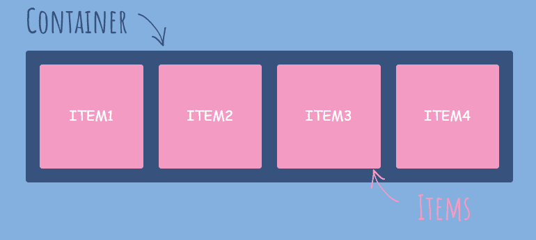

# Introdução ao Flexbox

- Modelo de Layout unidimensional 
    - A ideia é que haja a manipulação principal do layout em apenas uma direção, seja na horizontal (Eixo X) ou na Vertical (Eixo Y)
- Método que pode oferecer distribuição de espaçamento entre itens em uma interface e recursos de alinhamento
    - Pensando no alinhamento igual entre itens de uma tela sem necessidade de valores extaos, mas que a ferrmenta possa determinar isso a partir do tamanho da tela do dispositivo.

## Flex Container

Como mencionamos no curso de CSS, elementos no HTML pode estar aninhados.
Pensando nessa situação, o elemento que aninha outro terá a função de Container no Flexbox, enquanto o elemento aninhado é o elemento filho (herdeiro).

Neste elemento container será utilizada a propriedade "display" com o valor "flex" para que o **Flexbox** seja utilizado. E teremos uma situação como no caso abaixo:

### Propriedades Relacionadas

Quando um elemento recebe a característica de Container no Flexbox, a ele podem ser atribuídas algumas propriedades como:

 - display → Conforme mostrado acima
 - flex-direction → direcionamento dos itens dentro do container, linha ou coluna
 - flex-wrap → Atua sobre a quebra de linha no container
 - flex-flow → Estiliza a disposição dos itens no container, é um atalho para utilizar as duas propriedades acima mencionadas
 - justify-content → alinha os itens do container de acordo com a direção estabelecida
 - align-items → alinha os itens de acordo com o eixo do container
 - align-content → alinha as linhas do container

 ## Flex Item

 São os elementos filhos diretos do Flex Container. Cada um deles também podem se tornar Flex Container caso tenham elementos filhos diretos a eles.

**OBS:** A propriedade do Flexbox é recursiva, e pode sempre ser aplicada quando a circunstância permitir.

### Propriedades

Assim como o Flex Container, quandos elementos filhos se tornam Flex Itens eles também recebem o direito de utilizar algumas propriedades:

 - flex-grow → Estiliza como funciona o crescimento do item
 - flex-basis → Determina o tamanho do item antes da distribuição
 - flex-shrink → Capacidade de redução do tamanho do item
 - flex → Atalho para as 3 propriedades citadas acima
 - order → Determina a ordem em que os itens apareceram
 - align-self → Determina o alinhamento do item específico dentro do container.