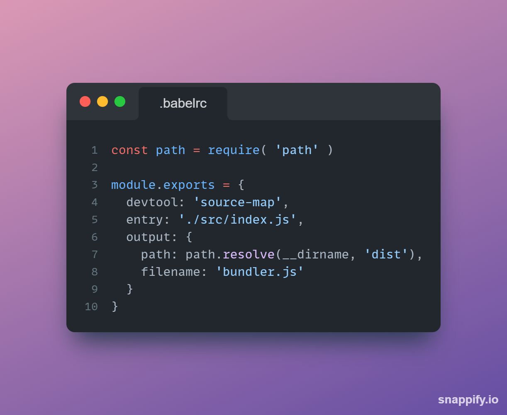
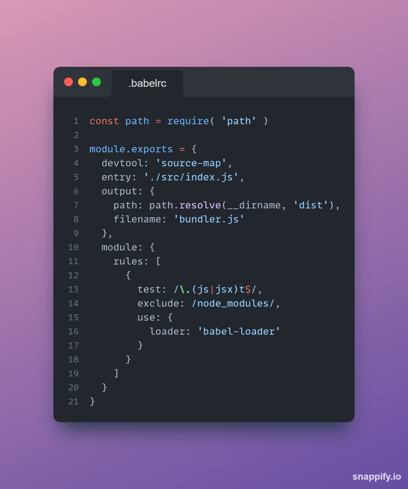
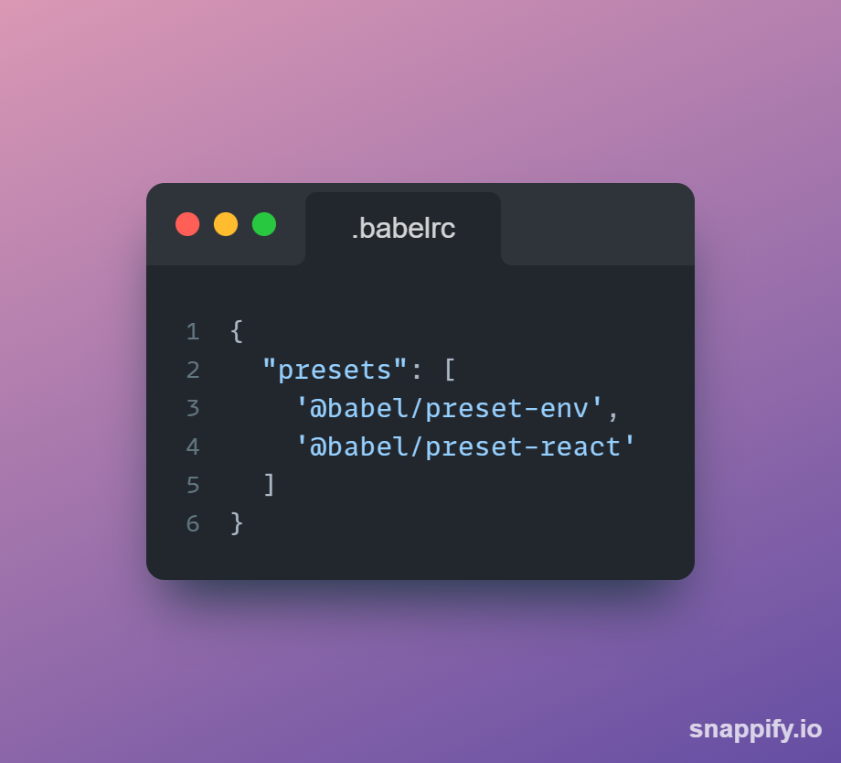

# Configuração

Principais conceitos do Webpack:

- **Entry Point:** Utilizando grafo, o Webpack precisa de um ponto de entrada para buscar todos os módulos e dependências.

- **Output:** É para determinar quais são os bundlers que o Webpack irá emitir.

- **Loadres:** É para permitir que o Webpack gerencie não só arquivos JavaScript

- **Plugins:** Plugins podem ser utilizados para otimização de pacotes, minificação, injeção de scripts e muito mais.

- **Mode:** Utilizados para a abordagaem de configuração zero. É possível configurar módulos como **production**, **development** ou **none**.

_Production:_ trás otimizações internas, cria o arquivo final para começar a utilizar.

_Development:_ É executado com três plugins: UglifyJsPlugin, ModuleConcatenationPlugin e NoEmitOnErrorsPlugin

-------

### Criação do arquivo webpack.config.js

Para isso, iniciamos o nosso projeto com o comando tradicional já para adicionarmos o ```package.json``` com o comando:

```
npm init
```

Para a instalação do webpack, utilizaremos o comando abaixo:

```
npm i -D webpack webpack-cli
```

Isso feito, o Webpack deve ter sido adicionado às dependências do projeto no ```packge.json```.

Na sequência, crie seu arquivo ```webpack.config.js```, e nele colocaremos a seguinte estrutura:



Nessa estrutura, temos a necessidade de importar o path para que o webpack faça a navegação.

A chave ```devtool: "source-map"``` no auxiliará a debugar o código no console do navegador. Quando o bundler é montado, o código é muito difícil de ser compreendido pelo ser humano, e o source-map auxilia o desenvolvedor a compreender este código.

E então o objeto com os pontos de entrada e saída serão exportados.
No ponto de entrada é necessário que o arquivo principal do diretório seja passado como valor para que o webpack possa mapear todo o código da aplicação através deste arquivo.
No ponto de saída, é necessário que seja passado um objeto para dizer onde o bundler será criado, que no exemplo será dentro do diretório principal por conta do ```__dirname```, e será feita a pasta dist, onde o bundler será criado dentro dela.
E então, o segundo valor será o nome do arquivo que o bundler feito receberá.

Isso feito, é necessário que seja criado o script dentro do ```package.json``` para que o bundler seja construído.
Para isso crie o seguinte script:
```
"build" : "webpack --mode production"
```

Isso feito, a pasta dist será criada e o bundler estará dentro dela. Lembre-se que antes de fazer isso, deve ser criado o arquivo ```index.js``` dentro da pasta ```src```.

-----------

### Babel

Para melhorar ainda mais a criação, para auxiliar na transpilação do código para que a maioria dos navegadores possam compreender, e gerar um código ainda mais eficiente instalamos também o Babel para nos auxiliar nessas tarefas. Utilize o comando abaixo:

```
npm i @babel/core babel-loader @babel/preset-env @babel/preset-react --save-dev
```

Com isso feito, é importante que no arquivo do Webpack seja dito que quem vai ajudá-lo a montar o bundler será o babel. Portanto, algumas coisas devem ser adicionadas ao arquivo ```webpack.config.js```:



Perceba que mais uma chave foi adicionada ao objeto exportado. Nessa chave devem ser declaradas as regras para a transpilação do babel. Nesse caso, colocamos que queremos que sejam transpilados arquivos ```.js``` e ```.jsx```, queremos que a pasta ```node_modules``` seja excluída da transpilação, e quem vai ficar a cargo da junção será o ```babel-loader```.

Além disso, para que os plugins necessários sejam utilizados também, é necessário que um outro arquivo seja criado, o ```.babelrc``` com a seguinte estrutura:



Nesse arquivo devem ser listados todos os presets e plugins que o babel deverá utilizar na transpilação.

------------

### Finalização

Com tudo isso feito, a instalação do react e do reactDOM já podem ser feitos. E então basta criar a pasta ```public``` com o ```index.html```. E então criar a pasta ```src``` com o arquivo ```index.js``` e com todos os componentes da aplicação React.

Para finalizar, e conseguir rodar o projeto tranquilamente sem ter que ficar fazendo a build dele sempre, e conseguirmos agilizar o processo de desenvolvimento, precisamos de mais algumas coisas:

 - Instalar o ```html-webpack-plugin``` → para gerar o arquivo ```index.html``` na produção.
 - Instalar o ```webpack-dev-server``` → Para poder ter um servidor no ambiente de desenvolvimento para não precisar sempre fazer uma nova build do projeto.

Para instalar o html-webpack-plugin, basta rodar o comando abaixo:

```
npm i -D html-webpack-plugin
```

E então é necessário adicionar mais uma chave no objeto exportado do arquivo ```webpack.config.js```:

```
plugins: [
  new HtmlWebPackPlugin({
    template: './src/index.html',
    filename: './index.html'
  })
]
```

E com isso, o webpack irá criar o arquivo ```index.html``` que será utilizado na produção do projeto.

**OBS:** É importante lembrar de importar a classe HtmlWebPackPlugin com o comando

```
const HtmlWebPackPlugin = require('html-webpack-plugin')
```

E o último passo é instalar o webpack-dev-server com comando abaixo:

```
npm i -D webpack-dev-server
```

Essa dependência vai criar um servidor para o ambiente de desenvolvimento com um hot reload, assim, toda vez que houver alguma alteração no código salva, automaticamente já haverá um recarregamento da página do projeto.

Para utilizá-lo é necessário adicionar o seguinte script ao ```package.json```:

```
"start:dev" : "webpack-dev-server"
```

E então, para iniciar o projeto no ambiente de desenvolvimento basta utilizar o comando abaixo:

```
npm run start:dev
```