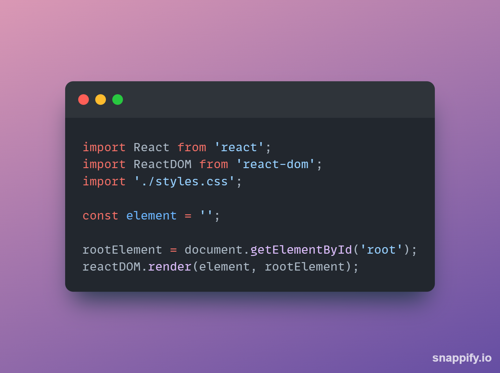
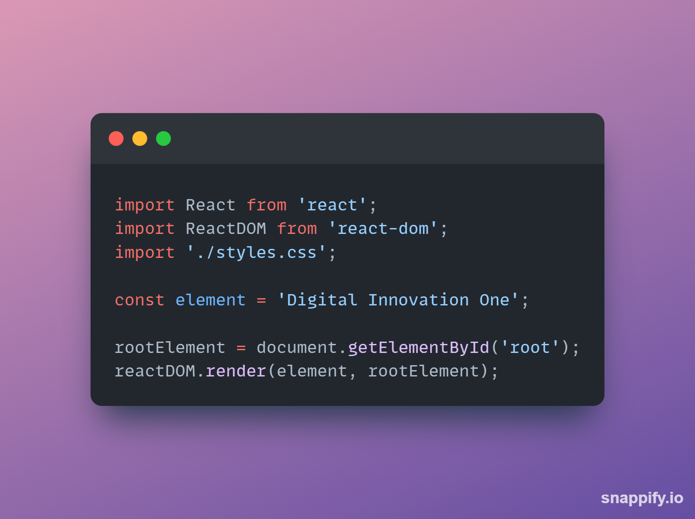
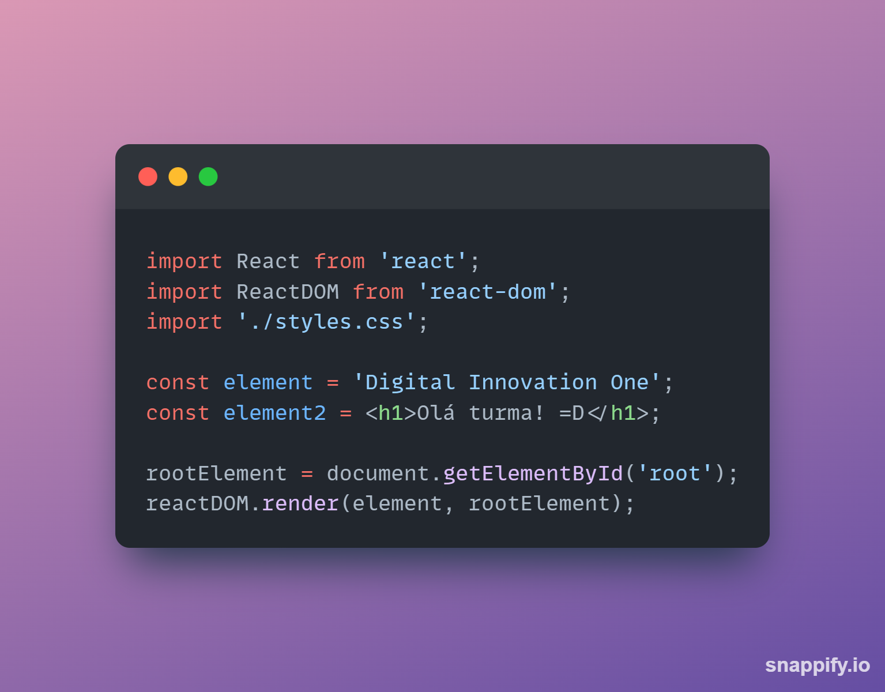
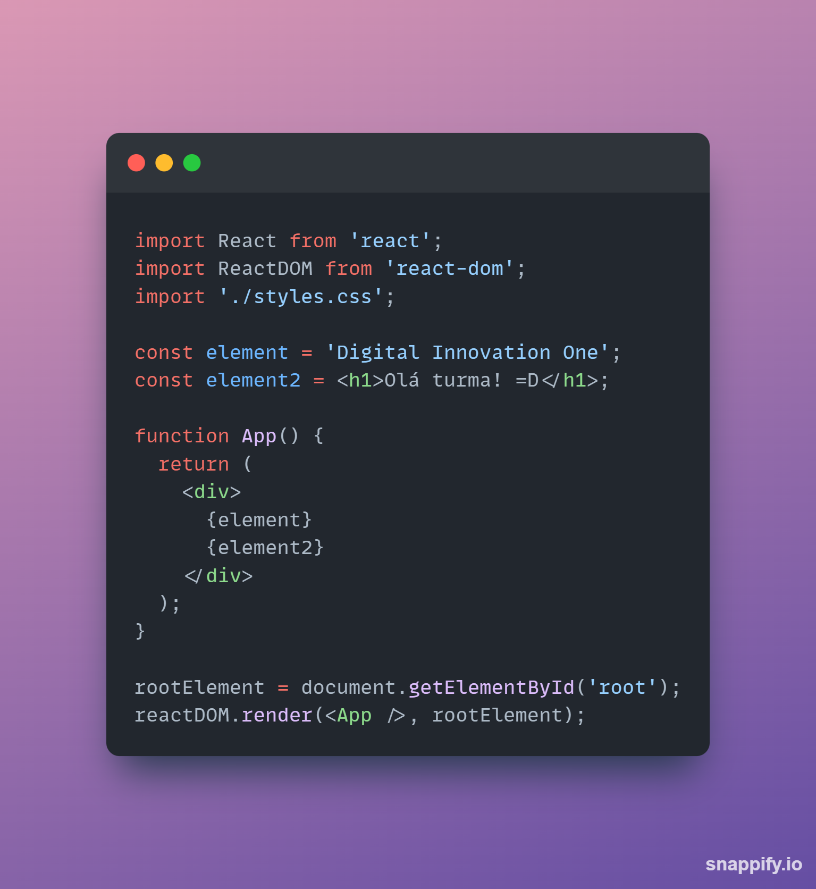
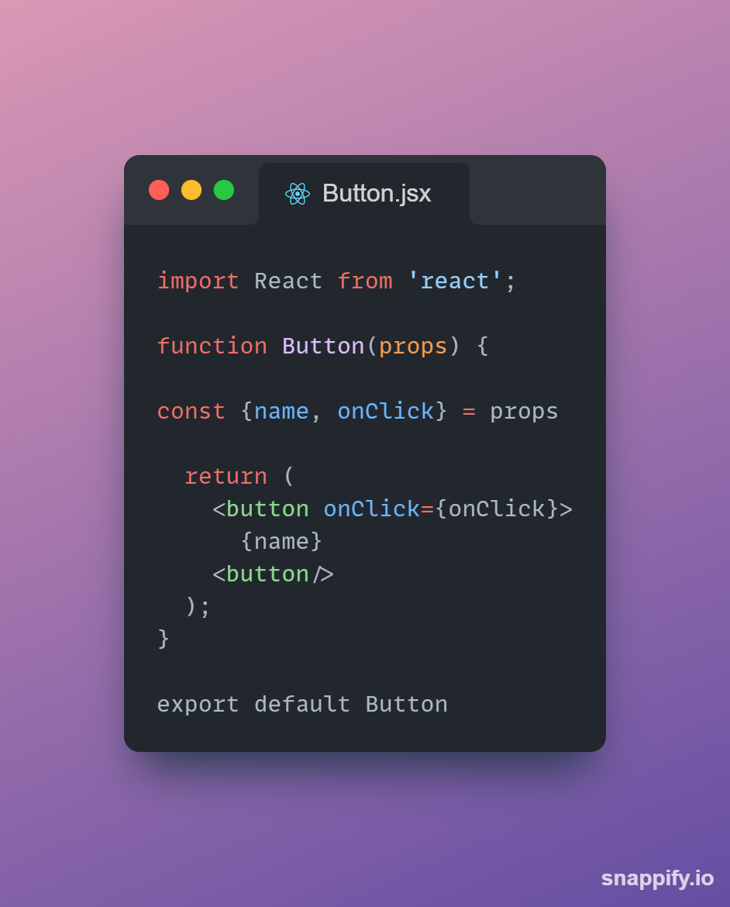
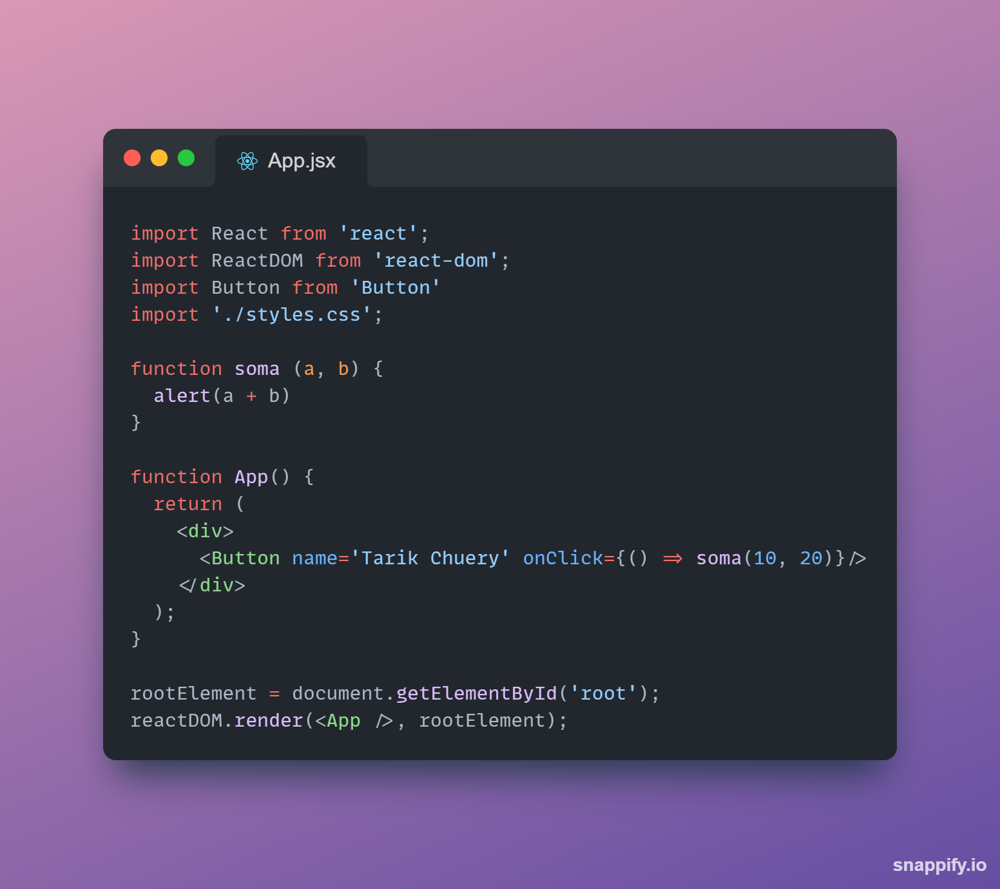

# Renderização

O Objeto responsável pela renderização de elementos se chama ReactDOM, como pudemos ver na aula anterior.

O React faz alterações no virtual DOM, e não no DOM diretamente. Ele faz as alterações necessárias do virtual DOM, e então é feita uma comparação entre o DOM virtual e o DOM e apenas aquilo que foi alterado é o que será renderizado. Isso é feito para aumentar a eficiência.

-------------

## Exemplo

Como vimos na aula anterior, é necessário uma estrutura HTML bem simples, que deve conter uma div com o id 'root'.
E vamos dar uma olhada onde a mágica acontece que é no JS:



No exemplo acima, perceba que no método ```render``` do ```reactDOM```, solicitamos que o que fosse renderizado é a constante element.
Como é uma string vazia, nada vai aparecer na nossa tela.



Entretanto, se adicionamos algo a string, então o que estiver ali, será renderizado na tela.
Entretanto, se eu construir outro elemento, este não será renderizado.



Neste caso, apenas o ```element``` será renderizado, e o ```element2``` ficará fora da página.
Para que ambos elementos sejam renderizados, é necessário que um componente seja criado através de uma função:



Perceba que o componente criado deve retorna uma tag do HTML, e então os elementos deve ser colocados dentro dessa estrutura.
Além disso, é necessário substituir no parâmetro do método ```render()``` o que você deseja renderizar. Não é mais o element, mas sim o componente App, que deve ser passado da seguinte maneira: ```<App />```.

----------

## Componentes e Props

Um componente funciona como pessinhas de Lego, logo você tende a juntar todas as peças para montar seu projeto.
As props são os parâmetros passados para esses componentes.

---------

### Exemplo

Os componentes devem sempre ser o mais puro possível, sem estado (será tratado mais tarde), sem funções internas, para que possam ser reaproveitados ao máximo.
Para que eles tenham as adaptações necessárias, as especificidades podem ser passadas via props:



Perceba que no exemplo acima é criado o componente Button em um arquivo com extensão ```.jsx```, mas que pode ser feito em ```.js``` sem problemas. É uma boa prática o nome do arquivo ser o nome do componente e ambos começando com letra maiúscula.

Perceba que a função que gera o JSX do componente recebe um parâmetro chamado props. Esse parâmetro é um objeto, e nele é armazenado todos os argumentos enviados quando o componente é utilizado. Nesse caso, esse componente pode receber os argumentos ```name``` e ```onClick```, onde name será o texto do botão, e onClick será a ação que deve ser executada quando o botão for clicado.

Vamos ver a utilização do componente ```Button``` no componente principal da aplicação:



Perceba nesse exemplo que o componente Button foi importado para então ser utilizado.
Quando colocado no JSX do componente principal App, dois argumentos foram passados. Para name foi passado uma string e para o onClick foi passada a função soma, que quando clicado surgirá a soma de 10 e 20 na tela.